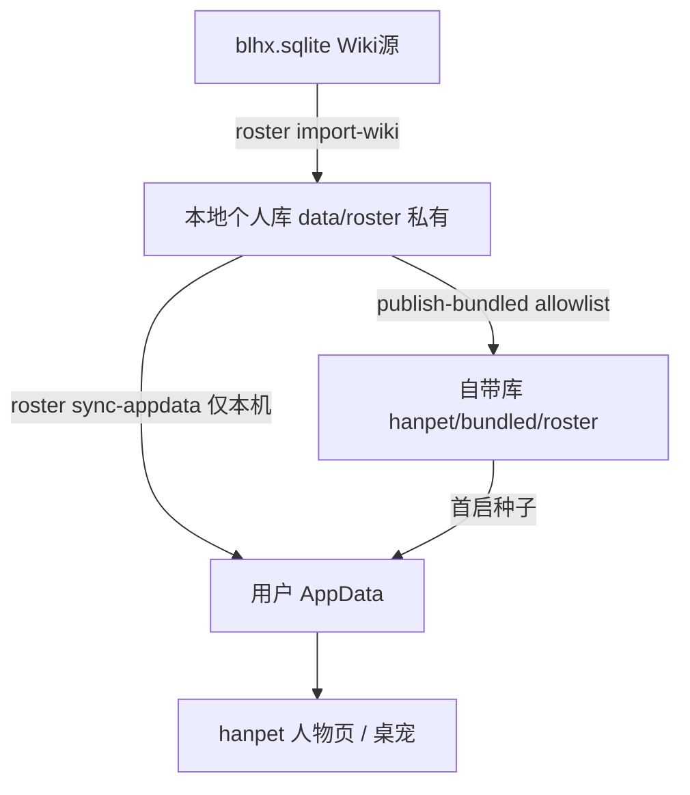
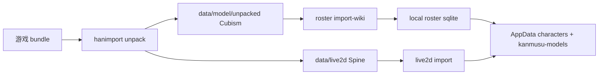

# HANDAILY 项目布局

HANDAILY 为**项目级** monorepo：应用 + 工作数据 + 导入工具 + 共享基础设施。

```
HANDAILY/
├── hanpet/              # 小寒桌宠（src、src-tauri、bundled、public）
├── hanimport/           # 小寒导入器（开发工具）
├── hantransfer/         # 手机 ↔ PC 传输（可选）
├── data/                # 工作数据（含本地个人 roster 库）
├── mcp/                 # MCP 服务
├── packages/            # 共享 npm 包
├── docs/                # 文档
├── scripts/             # 项目级构建脚本
├── Cargo.toml           # Rust workspace
└── .cargo/              # Rust 编译配置
```

## 应用职责

### hanpet（小寒桌宠）

- 桌面桌宠（Spine / Cubism 共用 pet 窗）、人物皮肤、设置、托盘
- **无独立舰娘页**：Cubism 挂在人物 → 皮肤（`kanmusu_dir`）
- 运行时数据：`%AppData%/xiaohan-daily/data/`
- 自带预览：`hanpet/bundled/roster/`（allowlist 子集 + 内置模型）

### hanimport（小寒导入器）

- 游戏 AssetBundle 解包 → `data/live2d` / `data/model/unpacked`
- 角色内容库：`npm run roster:*`（本地个人库 / 自带库发布）
- **不**打入 hanpet 安装包

### data（工作数据）

| 子目录 | 用途 | Git |
|--------|------|-----|
| `live2d/` | Spine 源 | 忽略内容 |
| `model/unpacked/` | Cubism 解包 | 忽略内容 |
| `wiki/` | BWIKI sqlite / EN 补表 | sqlite 忽略；小 JSON 可提交 |
| `roster/` | **本地个人** `handaily-roster.sqlite` | sqlite 忽略；schema/allowlist 提交 |
| `import/` | 导入计划 | 忽略计划文件 |

详见 [data/README.md](../data/README.md)。

## 角色数据三层



| 层级 | 给用户？ | 命令 |
|------|----------|------|
| 本地个人库 | 否 | `npm run roster:import` |
| 自带预览库 | 是（白名单） | `npm run roster:publish` |
| 导出数据包 | 按需 | `roster_db.py export-pack` |

禁止把本地个人库整文件拷进 bundled。

## 数据流（模型）



## 相关设计

- [统一角色皮肤](superpowers/specs/2026-07-14-unified-character-skins-design.md)
- [双轨角色库](superpowers/specs/2026-07-14-dual-roster-database-design.md)
- [舰娘桌宠（Cubism companion）](superpowers/specs/2026-07-14-kanmusu-desktop-pet-design.md)（入口已并入人物页）
- [整体点击 + main_*](superpowers/specs/2026-07-15-kanmusu-whole-main-touch-design.md)
- [桌宠/舰娘布局分存](superpowers/specs/2026-07-15-companion-layout-split-design.md)
- [角色库可视化与 Wiki 全自动补齐](superpowers/specs/2026-07-15-roster-auto-pipeline-design.md)（进度总表见 [README](README.md#2026-07-15-进度已落地)）

## 迁移阶段

| 阶段 | 内容 |
|------|------|
| **当前** | 人物统一皮肤 + 本地/自带 roster sqlite；hanimport 网页（解包 Job / 角色库 / Wiki 全自动补齐 / 按皮台词）；独立舰娘页已移除 |
| Phase 1 | AssetBundle 解析 POC |
| Phase 2 | 导入命令完全迁入 hanimport |
| Phase 3 | App 直接读 roster sqlite（弱化仅 manifest） |

完整任务分解：[plans/2026-07-12-handaily-project-layout.md](plans/2026-07-12-handaily-project-layout.md)
