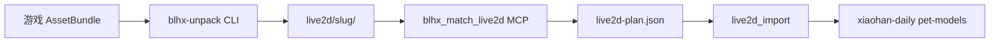

> **已废弃** — 请参阅 [2026-07-12-handaily-project-layout.md](./2026-07-12-handaily-project-layout.md)（hanpet / hanimport / data 布局）。

# HANDAILY Monorepo + blhx-unpack 实施计划（旧版）

> **For agentic workers:** REQUIRED SUB-SKILL: Use superpowers:subagent-driven-development (recommended) or superpowers:executing-plans to implement this plan task-by-task. Steps use checkbox (`- [ ]`) syntax for tracking.

**Goal:** 将 HANDAILY 整理为项目级 monorepo，并新增独立应用 `blhx-unpack` 用于解包碧蓝航线 Unity 资源为 Spine 目录，对接现有 `live2d_import` 流水线。

**Architecture:** 仓库根为 monorepo；`apps/xiaohan-daily` 承载主应用（先占位，后迁移）；`apps/blhx-unpack` 为上游 Rust CLI，输出 `live2d/<slug>/`；共享逻辑逐步抽到 `packages/` / `crates/`。现有根目录代码在 Phase 2 前保持可运行。

**Tech Stack:** Rust（解包核心 + 现有 Tauri）、TypeScript（MCP 共享 slug）、Unity AssetBundle 解析库（待选型：UnityPy 封装或 Rust `unity_*` crate）、现有 `@pixi-spine` 不变。

## Global Constraints

- 先完成目录与计划，**Phase 1 前不迁移** `src/` / `src-tauri/` 到 `apps/xiaohan-daily/`
- `blhx-unpack` 与发行版 Tauri 应用**解耦**（独立 binary / crate）
- 输出目录必须符合 `mcp/blhx-wiki/src/live2d.ts` 的 slug 约定
- 不重新引入 `AzurLaneSD-master/` 依赖；仅参考 ViewerEX type=9 config 形状
- Windows 10/11 为主要开发与测试平台
- 个人研究用途；不在主应用内嵌解包 UI（v1）

---

## 目标目录结构

```
HANDAILY/                          # monorepo 根（当前即仓库根）
├── apps/
│   ├── xiaohan-daily/             # 主应用（Phase 2 迁入）
│   └── blhx-unpack/               # 碧蓝航线解包 CLI（新建）
├── packages/                      # 共享 TS/Rust 库（Phase 3）
├── crates/                        # Rust workspace 成员（Phase 1 起）
├── mcp/                           # 现有 MCP 服务（保持）
├── bundled/                       # 主应用内置资源（迁移前在根）
├── docs/
│   └── plans/                     # 本计划
└── live2d/                        # 解包输出（gitignore，已有）
```

## 数据流



---

## Phase 0 — 脚手架（本阶段，已完成）

- [x] **0.1** 创建 `apps/xiaohan-daily/`、`apps/blhx-unpack/`、`packages/`、`docs/plans/`
- [x] **0.2** 编写 `apps/blhx-unpack/docs/DESIGN.md` 与 README
- [x] **0.3** 创建 `.specs/tasks/draft/` 任务草稿
- [x] **0.4** 本实施计划文档

**验证：** 目录存在；文档可读；根目录 `npm run tauri:dev` 仍可从根启动（未移动代码）。

---

## Phase 1 — blhx-unpack 最小可运行 CLI

### Task 1: Rust workspace 初始化

**Files:**
- Create: `Cargo.toml`（workspace 根）
- Create: `apps/blhx-unpack/Cargo.toml`
- Create: `crates/blhx-unpack-core/Cargo.toml`
- Create: `apps/blhx-unpack/src/main.rs`
- Modify: `.cargo/config.toml`（确认 `target-dir` 仍指向 `src-tauri/target` 或改为 workspace 统一目录）

- [ ] **1.1** 在仓库根添加 `[workspace]`，`members = ["apps/blhx-unpack", "crates/blhx-unpack-core"]`
- [ ] **1.2** `blhx-unpack` binary 使用 `clap`：`--input <path>`、`--output <path>`（默认读 `HANDAILY_LIVE2D_PATH`）
- [ ] **1.3** 实现 `--version` / `--help`，无输入时打印用法说明
- [ ] **1.4** `cargo run -p blhx-unpack -- --help` 通过

### Task 2: AssetBundle 解析 POC

**Files:**
- Create: `crates/blhx-unpack-core/src/lib.rs`
- Create: `crates/blhx-unpack-core/src/bundle/mod.rs`
- Create: `apps/blhx-unpack/src/cli.rs`

- [ ] **2.1** 调研并锁定解析方案（UnityPy subprocess vs Rust crate），记录于 `apps/blhx-unpack/docs/PARSER.md`
- [ ] **2.2** 对 **1 个** 已知 `.ab` 样本列出内部对象树（测试夹具放 `apps/blhx-unpack/fixtures/`，gitignore 大文件）
- [ ] **2.3** 提取首个 `.skel` + `.atlas` + `.png` 到临时目录
- [ ] **2.4** 单元测试：给定 fixture metadata，断言三件套文件存在且非空

### Task 3: 输出布局与 slug 命名

**Files:**
- Create: `crates/blhx-unpack-core/src/layout/mod.rs`
- Create: `apps/blhx-unpack/docs/OUTPUT_LAYOUT.md`

- [ ] **3.1** 定义输出规则：`live2d/<slug>/`，slug 规则对齐 `mcp/blhx-wiki/src/live2d.ts`（拼音、`_2` 皮肤后缀）
- [ ] **3.2** CLI `--dry-run` 只打印将写入的路径
- [ ] **3.3** 集成测试：解包结果目录通过 `blhx_scan_live2d` 扫描（手动或脚本）

**Phase 1 验收：**
```bash
cargo run -p blhx-unpack -- --input <bundle.ab> --output ./live2d
# live2d/<slug>/ 含 .skel .atlas .png
```

---

## Phase 2 — 主应用迁入 apps/xiaohan-daily（可选，大改动）

- [ ] **2.1** 将 `src/`、`src-tauri/`、`bundled/`、`public/`、`scripts/`、`package.json` 等移入 `apps/xiaohan-daily/`
- [ ] **2.2** 更新 `.cargo/config.toml`、`vite.config.ts`、CI、文档中所有相对路径
- [ ] **2.3** 根 `package.json` 改为 workspaces + `npm run dev -w xiaohan-daily`
- [ ] **2.4** 根 README 改为 monorepo 索引

**验证：** `npm run tauri:dev` 从 `apps/xiaohan-daily` 或根 workspace 脚本正常启动。

---

## Phase 3 — 共享库抽取

- [ ] **3.1** `crates/handaily-spine-pack` — 从 `src-tauri/src/pet/models.rs` 抽出 `inspect_spine_folder`、`generate_viewer_ex_config`
- [ ] **3.2** `packages/blhx-slug-match` — 从 `mcp/blhx-wiki/src/live2d.ts` 抽出匹配逻辑
- [ ] **3.3** `blhx-unpack` 与 `live2d_import` 共用 `handaily-spine-pack`
- [ ] **3.4** MCP 改用 `@handaily/blhx-slug-match`

---

## Phase 4 — 可选增强

- [ ] **4.1** MCP 工具 `blhx_unpack_bundle`
- [ ] **4.2** 批量模式：`--game-root` 扫描舰娘相关 bundle
- [ ] **4.3** CRI 音频提取（`.acb`/`.awb`）
- [ ] **4.4** xiaohan-daily 设置页调用 sidecar（非 v1）

---

## 相关任务文件

| 文件 | 类型 |
|------|------|
| `.specs/tasks/draft/restructure-handaily-monorepo.chore.md` | monorepo 结构 |
| `.specs/tasks/draft/implement-blhx-unpack-app.feature.md` | 解包应用实现 |

## 下一步（给用户）

1. 审阅 `apps/blhx-unpack/docs/DESIGN.md` 与本文 Phase 1 范围
2. 准备 1～2 个可合法用于开发的 AssetBundle 样本（放本地，不入库）
3. 确认后执行：`/plan-task .specs/tasks/draft/implement-blhx-unpack-app.feature.md` 细化 Phase 1 任务
4. 再开新会话按 Phase 1 写代码
