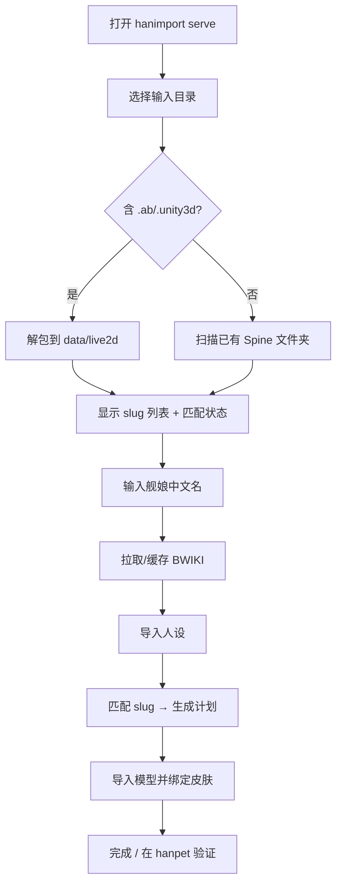

# hanimport 开发者导入工具 — 初步计划

> **For agentic workers:** REQUIRED SUB-SKILL: Use superpowers:subagent-driven-development (recommended) or superpowers:executing-plans to implement this plan task-by-task.

**Goal:** 为 hanpet 开发者提供本地网页端导入工具：自动检索/解包碧蓝航线 Spine 模型目录，输入舰娘名称后从 BWIKI 拉取资料并一键导入人设与模型。

**Architecture:** `hanimport serve` 启动本地 HTTP 服务（Rust axum + Vite 静态页）；重资产操作（解包、BWIKI、模型入库）走已有 CLI/MCP 流水线，Web 层只做编排与进度展示。解包输出对齐 `data/live2d/<slug>/` 与 `mcp/blhx-wiki` slug 规则。

**Tech Stack:** Rust（hanimport 核心 + axum）、TypeScript（`hanimport/web/` 前端）、复用 `mcp/blhx-wiki`（BWIKI 抓取与 slug 匹配）、Unity AssetBundle 解析（UnityPy 子进程桥接，v1 优先落地）。

## Global Constraints

- **仅开发工具**，不进入 hanpet 发行包
- **本地网页**：`http://127.0.0.1:<port>`，默认仅本机访问
- hanpet 桌宠模型格式为 **Spine 三件套**（`.skel` + `.atlas` + `.png`），存放于 `data/live2d/`（项目内称 live2d，实为 Spine）
- 游戏内 `/live2d` 为 Cubism `.moc3`，**非** hanpet 目标；解包重点为 `spinepainting` 类 bundle
- 输出 slug 对齐 `mcp/blhx-wiki/src/live2d.ts`（拼音、`_2` 皮肤后缀）
- Windows 10/11 主平台；个人研究用途
- v1 不追求全量自动化，以「单舰娘导入」闭环为验收

## 术语说明

| 名称 | 含义 |
|------|------|
| live2d 目录 | 项目工作目录 `data/live2d/`，存 Spine 模型 |
| 解包 | Unity AssetBundle → Spine 三件套文件夹 |
| 人设 | BWIKI 舰娘性格/台词，写入 hanpet `personas/` |
| 模型 | Spine 文件，写入 hanpet `pet-models/` 并绑定皮肤 |

## 参考示例（网上常见流程）

社区解包碧蓝航线资源通常分三步，本计划取其自动化思路、不直接依赖 GUI 工具：

1. **[AssetStudio](https://github.com/Perfare/AssetStudio)** — 从 `AssetBundles/` 导出 Mesh、Texture2D
2. **[AzurLanePaintingExtract](https://github.com/azurlane-doujin/AzurLanePaintingExtract-v1.0)** — Spine atlas 切割、立绘重组
3. **[Bakabase/AzurLane](https://github.com/Bakabase/AzurLane)** — adb/本地目录批量提取 + 合成流水线参考

游戏资源路径（Android 包）：`…/com.bilibili.azurlane/files/AssetBundles/`，Spine 相关多在 `spinepainting/`。

hanimport 目标是把上述手工步骤收成：**选目录 → 自动扫描 → 解包到 slug 文件夹 → 输名称 → Wiki 导入 → 模型入库**。

## 目标结构

```
hanimport/
├── src/
│   ├── main.rs
│   ├── cli.rs              # 新增 serve 子命令
│   ├── server/             # axum 路由 + job 状态
│   ├── unpack/             # 已有扫描 + 解包实现
│   └── delegate.rs         # 已有：转发 cargo/npm
├── web/                    # Vite 前端
│   ├── index.html
│   ├── src/
│   │   ├── App.tsx
│   │   └── api.ts
│   └── package.json
└── docs/DESIGN.md          # 同步更新（允许 Web UI）
```

## 用户流程（Web UI）



### 页面分区（单页即可）

| 区块 | 功能 |
|------|------|
| 资源 | 选择游戏 AssetBundles 目录或已有 `data/live2d`；显示扫描结果 |
| 解包 | 一键解包 / dry-run；进度条 + 日志 |
| 人设 | 输入舰娘名；触发 BWIKI fetch + `blhx_import` |
| 模型 | 自动 slug 匹配；预览计划；执行 `live2d_import` |
| 日志 | 子进程 stdout/stderr 流式输出 |

## 技术选型结论

| 层 | 选型 | 理由 |
|----|------|------|
| 核心逻辑 | **Rust**（hanimport） | 已有 CLI、解包、路径解析；与 hanpet 同 workspace |
| 本地 Web 服务 | **axum** | 轻量、与 Rust 一体、`hanimport serve` 单命令启动 |
| 前端 | **Vite + TypeScript** | 与 hanpet/mcp 技术栈一致；开发体验好 |
| BWIKI | **复用 mcp/blhx-wiki** | 已有 `blhx_fetch_ship`、`blhx_match_live2d`、`live2d-plan` |
| 解包 v1 | **UnityPy（Python 子进程）** | 社区验证充分；Rust native crate 作为 Phase 2 优化 |
| 解包 v2 | Rust `unity_*` / 内嵌解析 | 去 Python 依赖 |

**不选 Tauri 独立应用**：与 hanpet 重叠，开发成本高；本地网页 + 浏览器足够。

**不选纯 Node 服务**：解包与路径逻辑应在 hanimport Rust 侧统一。

## API 草案（axum）

| 方法 | 路径 | 说明 |
|------|------|------|
| GET | `/api/status` | 服务状态、默认路径 |
| POST | `/api/scan` | `{ "input": "path" }` → bundles + spine 文件夹列表 |
| POST | `/api/unpack` | `{ "input", "output?", "dry_run?" }` → job_id |
| POST | `/api/wiki/fetch` | `{ "name": "欧根亲王" }` → 触发 BWIKI 抓取 |
| POST | `/api/persona/import` | `{ "name" }` 或 `{ "names": [] }` |
| POST | `/api/plan` | 生成 `data/import/live2d-plan.json` |
| POST | `/api/models/import` | `{ "dry_run?", "limit?" }` |
| GET | `/api/jobs/:id` | 长任务状态 |
| GET | `/api/jobs/:id/log` | SSE 日志流 |

长任务（解包、批量导入）用后台 `tokio::process` + job 表，避免阻塞 HTTP。

## 实施阶段

---

### Phase 0 — Web 脚手架（可演示空壳）

**验收：** `npm run hanimport:serve` 打开浏览器，显示四步向导空页面。

- [ ] `hanimport/web/` Vite 项目 + 根 workspace 注册
- [ ] `hanimport serve [--port 7821]`：axum 托管 `web/dist` + `/api/status`
- [ ] 根 `package.json` 增加 `hanimport:serve`、`hanimport:web:build`
- [ ] 更新 `hanimport/README.md`、`docs/DESIGN.md`（Web UI 从非目标改为 v1 范围）

---

### Phase 1 — 扫描与解包

**验收：** 指定含 `.ab` 的目录，解包至少 1 个舰娘到 `data/live2d/<slug>/`，含 Spine 三件套。

#### Task 1.1：完善扫描 API

- [ ] 扩展 `unpack::discover_bundles`：同时识别已解包的 Spine 文件夹（复用 `live2d.ts` 的 `hasSpine` 判定逻辑，可先通过调用 `mcp/blhx-wiki` 的 `blhx_scan_live2d`）
- [ ] `POST /api/scan` 返回 `{ bundles[], spineFolders[] }`

#### Task 1.2：UnityPy 解包桥接

- [ ] `hanimport/scripts/unpack_spine.py`：输入 bundle 路径，输出 slug 目录（参考 AzurLanePaintingExtract 的 atlas 切割思路）
- [ ] Rust `unpack/extract.rs`：调用 Python，解析 stdout 进度
- [ ] slug 命名：从 bundle 路径/内部资源名推导拼音（对齐 `live2d.ts`）
- [ ] 支持 `--dry-run` 仅列出将写入的 slug

#### Task 1.3：Web 解包面板

- [ ] 目录选择（文本输入路径即可，v1 不做系统文件对话框）
- [ ] 解包按钮 + SSE 日志 + 结果列表

---

### Phase 2 — 名称驱动 BWIKI 导入

**验收：** 输入「欧根亲王」，本地 SQLite 有缓存，hanpet 可看到导入的人设。

- [ ] `POST /api/wiki/fetch`：包装 `blhx_fetch_ship`（无缓存时抓取，有则跳过）
- [ ] `POST /api/persona/import`：包装 `hanimport personas -- <name>` 或 `--all` 子集
- [ ] Web「人设」区：名称输入 + 抓取状态 + 导入按钮
- [ ] 首次使用引导：若 `data/wiki/blhx.sqlite` 为空，提示先 `blhx_sync_catalog`（可提供一键按钮）

---

### Phase 3 — 匹配与模型入库

**验收：** 解包后的 slug 自动匹配舰娘，执行后 hanpet 中该角色有对应皮肤模型。

- [ ] `POST /api/plan`：包装 `hanimport plan`
- [ ] `POST /api/models/import`：包装 `hanimport models`（支持 dry-run）
- [ ] Web 显示匹配分数、未匹配 slug 列表（引导编辑 `data/live2d-aliases.json`）
- [ ] 单舰娘快捷模式：仅处理当前输入名称相关的 plan 条目

---

### Phase 4 — 打磨（可选，初步计划外）

- [ ] 系统文件夹选择器（Windows `rfd` 或浏览器 File System Access API 降级）
- [ ] 解包 Rust 原生实现，去除 Python 依赖
- [ ] `packages/blhx-slug-match` 抽取，Web/Rust/Node 共用
- [ ] 批量模式：整个 `data/live2d` 一键 plan + import

## 与现有组件关系

```
hanimport serve (Web)
    ├─► unpack/          → data/live2d/<slug>/
    ├─► mcp/blhx-wiki    → data/wiki/blhx.sqlite
    ├─► blhx_import      → hanpet personas
    └─► live2d_import    → hanpet pet-models
```

| 已有能力 | hanimport 子命令 | Web 封装 |
|----------|------------------|----------|
| Bundle 扫描 | `unpack --dry-run` | `/api/scan` |
| 解包 | `unpack` | `/api/unpack` |
| slug 匹配 + 计划 | `plan` | `/api/plan` |
| BWIKI 人设 | `personas` | `/api/persona/import` |
| 模型入库 | `models` | `/api/models/import` |

## 验收清单（初步计划完成标准）

- [ ] `hanimport serve` 本地打开网页，四步流程可走通
- [ ] 从游戏 AssetBundles 目录解包 ≥1 个舰娘 Spine 到 `data/live2d/`
- [ ] 输入中文舰娘名，完成 BWIKI 抓取 + 人设导入
- [ ] 自动 slug 匹配并导入模型，hanpet 开发者可在应用内看到该角色皮肤
- [ ] 全程日志可在网页查看；CLI 子命令仍独立可用（Web 不替代 CLI）

## 风险与降级

| 风险 | 降级 |
|------|------|
| UnityPy 解包失败 / 版本不兼容 | 文档说明用手动 AssetStudio 导出到 `data/live2d/`，Web 只做后续 Wiki+导入 |
| BWIKI 反爬 / 无网络 | 依赖本地 `blhx.sqlite`；UI 提示离线模式 |
| slug 匹配失败 | 暴露 `live2d-aliases.json` 编辑入口；允许手动指定 slug↔舰娘 |
| Python 环境缺失 | 启动时检测，提示安装 Python 3.10+ |

## 启动命令（目标）

```bash
# 开发
npm run hanimport:serve

# 或
cargo run -p hanimport -- serve --port 7821
```

浏览器访问 `http://127.0.0.1:7821`。

## 相关文档

- [hanimport/docs/DESIGN.md](../../hanimport/docs/DESIGN.md)
- [docs/plans/2026-07-12-handaily-project-layout.md](./2026-07-12-handaily-project-layout.md)
- [docs/questions/131-live2d文件夹匹配与批量导入-20260707.md](../questions/131-live2d文件夹匹配与批量导入-20260707.md)
- [mcp/blhx-wiki/README.md](../../mcp/blhx-wiki/README.md)
