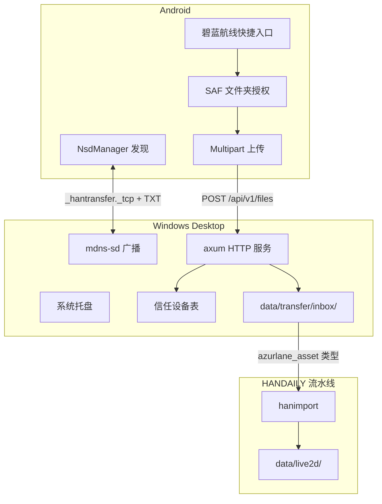
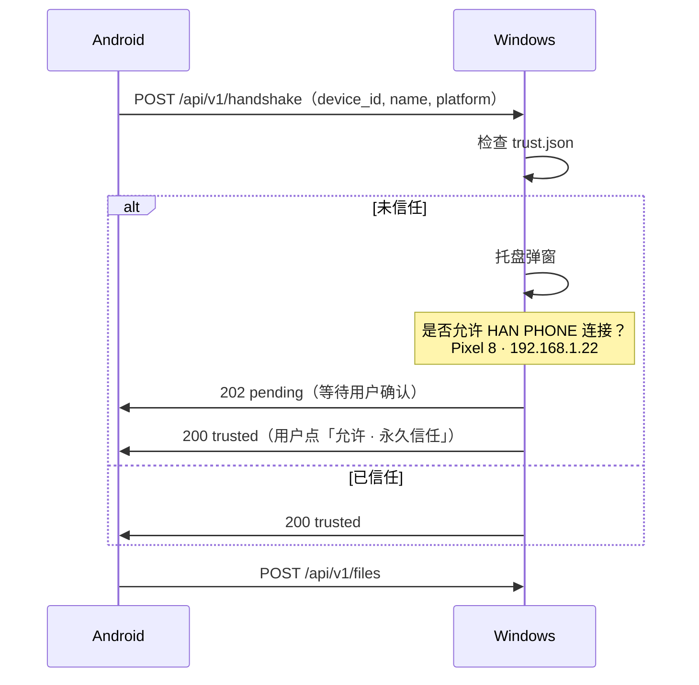

# hantransfer 设计文档

> **状态：** 已评审（2026-07-13）  
> **定位：** HANDAILY monorepo 下的局域网文件桥接工具，不进 hanpet 发行包。

## 1. 产品定位

**hantransfer（小寒传文件）** 是 HANDAILY 第一个跨端辅助工具，在电脑与安卓手机之间建立局域网文件通道。

与通用 AirDrop 替代方案不同，hantransfer 的核心价值是衔接 HANDAILY 开发工作流：

```
手机采集资源（碧蓝航线 AssetBundles）
        ↓
hantransfer（局域网搬运）
        ↓
data/transfer/inbox/
        ↓
hanimport（解包 / 扫描 / 计划）
        ↓
data/live2d/<slug>/
        ↓
hanpet（人设 / 模型管理）
```

| 角色 | 职责 |
|------|------|
| 手机 | 资源采集（通用文件 + 游戏 AssetBundles 快捷入口） |
| hantransfer | 局域网发现、信任、传输、收件 |
| hanimport | 解析、匹配、导入计划 |
| hanpet | 运行时人物与模型管理 |

## 2. 已确认决策

| 决策 | 结论 |
|------|------|
| 平台 | Windows 电脑端 + Android 手机端（v1 不含 iOS） |
| 发现方式 | mDNS 自动发现，TXT 携带设备能力元数据 |
| 信任机制 | v1 首次连接确认 + 永久信任；v1 不做端到端加密 |
| 传输协议 | 固定 HTTP API（`POST /api/v1/files`），metadata + file 双 part |
| 收件目录 | `data/transfer/inbox/`（与 `data/import/` 语义分离） |
| 游戏目录授权 | Android SAF（`ACTION_OPEN_DOCUMENT_TREE`），持久化 URI |
| Web 管理界面 | 非 MVP；HTTP 服务预留 `GET /` 简单状态页 |
| 参考实现 | [LocalSend](https://github.com/localsend/localsend) 架构思路，协议自研轻量版 |

## 3. 系统架构



### 3.1 目录结构

```
HANDAILY/
├── hantransfer/
│   ├── desktop/              # Rust 托盘 + HTTP 服务
│   │   ├── src/
│   │   │   ├── main.rs
│   │   │   ├── tray.rs
│   │   │   ├── server.rs
│   │   │   ├── discovery.rs
│   │   │   ├── transfer.rs
│   │   │   ├── trust.rs
│   │   │   ├── config.rs
│   │   │   └── importer.rs   # 收件后路由（普通 / azurlane）
│   │   ├── Cargo.toml
│   │   └── README.md
│   ├── android/              # Kotlin + Jetpack Compose
│   │   └── app/
│   │       ├── discovery/
│   │       ├── transfer/
│   │       ├── azurlane/
│   │       └── ui/
│   └── proto/                # 共享协议
│       ├── api.yaml          # OpenAPI 3
│       └── schema/
│           ├── metadata.json
│           └── device-txt.json
├── data/
│   ├── transfer/             # hantransfer 专用（新增）
│   │   ├── inbox/            # 收件
│   │   ├── history/          # 传输记录 JSON
│   │   └── temp/             # 分块临时文件
│   ├── import/               # hanimport 计划等（不变）
│   └── live2d/               # 解包输出（不变）
└── docs/plans/
    └── hantransfer-design.md # 本文档
```

### 3.2 技术栈

| 端 | 技术 | 主要依赖 |
|----|------|----------|
| 电脑 | Rust | `axum`, `tokio`, `mdns-sd`, `tray-icon`, `serde`, `uuid`, `sha2`, `notify` |
| 安卓 | Kotlin + Compose | `NsdManager`, OkHttp multipart, SAF DocumentTree |
| 协议 | HTTP REST + JSON Schema | `proto/api.yaml` 为唯一真相源 |

## 4. 设备发现（mDNS）

### 4.1 服务类型

```
_hantransfer._tcp.local
```

### 4.2 TXT 记录

键值对形式（非嵌套 JSON，mDNS 标准限制）：

| Key | 示例 | 说明 |
|-----|------|------|
| `name` | `HAN-PC` | 用户可读设备名 |
| `platform` | `windows` | `windows` / `android` / `linux` / `steamdeck` |
| `version` | `0.1.0` | 协议版本 |
| `device_id` | `uuid` | 稳定设备标识 |
| `features` | `send,receive,azurlane-import` | 逗号分隔能力列表 |

**features 枚举：**

| 值 | 含义 |
|----|------|
| `send` | 可发起发送 |
| `receive` | 可接收文件 |
| `azurlane-import` | 支持碧蓝航线资源收件路由（PC 端） |

### 4.3 UI 展示

安卓端设备列表示例：

```
HAN-PC
Windows · v0.1.0
✓ 支持 hanimport 收件
```

而非仅显示 `DESKTOP-ABC123`。

## 5. 信任机制（v1 必做）

局域网主要风险是**误连邻居/公共 WiFi 设备**，不是窃听。v1 用「首次确认 + 永久信任」替代密码。

### 5.1 首次连接流程



### 5.2 信任存储

路径：`%AppData%/hantransfer/trust.json`（不进 git）

```json
{
  "devices": [
    {
      "device_id": "uuid",
      "name": "HAN PHONE",
      "platform": "android",
      "ip": "192.168.1.22",
      "trusted_at": "2026-07-13T10:00:00+08:00"
    }
  ]
}
```

用户可在托盘设置中撤销信任。

## 6. HTTP API 协议

> 完整定义见 `hantransfer/proto/api.yaml`。以下为 v0.1 核心端点。

### 6.1 握手

```
POST /api/v1/handshake
```

Request:

```json
{
  "device_id": "uuid",
  "name": "HAN PHONE",
  "platform": "android",
  "version": "0.1.0"
}
```

Response:

| 状态码 | 含义 |
|--------|------|
| `200` | 已信任，可传输 |
| `202` | 等待 PC 端用户确认 |
| `403` | 用户拒绝 |

### 6.2 文件传输

```
POST /api/v1/files
```

**Headers：**

| Header | 说明 |
|--------|------|
| `X-Hantransfer-Device-ID` | 发送方设备 UUID |
| `X-Hantransfer-Transfer-ID` | 本次传输 UUID（幂等 / 断点续传预留） |

**Body：** `multipart/form-data`，固定两个 part：

| Part 名 | 类型 | 内容 |
|---------|------|------|
| `metadata` | `application/json` | 见下方 schema |
| `file` | `application/octet-stream` | 文件二进制 |

**metadata.json schema：**

```json
{
  "filename": "example.ab",
  "size": 1048576,
  "hash": "sha256:abc123...",
  "type": "file",
  "source": "han-phone",
  "category": "general"
}
```

**type 枚举：**

| type | category 示例 | PC 收件路径 |
|------|----------------|-------------|
| `file` | `general` | `data/transfer/inbox/` |
| `azurlane_asset` | `live2d` / `spinepainting` / `custom` | `data/transfer/inbox/azurlane/<category>/` |

**azurlane_asset 示例：**

```json
{
  "filename": "ship_live2d.ab",
  "size": 2097152,
  "hash": "sha256:def456...",
  "type": "azurlane_asset",
  "source": "han-phone",
  "category": "live2d",
  "relative_path": "AssetBundles/live2d/xxx.ab"
}
```

### 6.3 传输校验

1. 接收前检查 `Content-Length` 与 `metadata.size`
2. 写入 `data/transfer/temp/<transfer_id>`
3. 计算 SHA256，与 `metadata.hash` 比对
4. 校验通过 → 移动到 `inbox/` 目标路径
5. 记录写入 `data/transfer/history/<date>.jsonl`

### 6.4 进度与状态（v0.1）

```
GET /api/v1/transfers/:id
```

返回 `{ "status": "receiving|verifying|done|failed", "bytes_received": N, "total": M }`

安卓端通过 OkHttp 上传进度回调 + 轮询或 SSE（v0.2）展示。

### 6.5 预留：简单状态页（非 MVP 必做）

```
GET /
```

返回极简 HTML：已连接设备、最近收件列表。托盘菜单提供「在浏览器打开」入口，v0.1 可返回 501 或占位页。

## 7. 数据目录

### 7.1 transfer 与 import 分离

| 路径 | 用途 | 管理者 |
|------|------|--------|
| `data/transfer/inbox/` | 所有局域网收件 | hantransfer |
| `data/transfer/inbox/azurlane/` | 碧蓝航线资源子目录 | hantransfer 按 type 路由 |
| `data/transfer/history/` | 传输记录 | hantransfer |
| `data/transfer/temp/` | 传输中临时文件 | hantransfer |
| `data/import/` | hanimport 计划、staging | hanimport |

**原因：** hantransfer 会收到图片、视频、文档、APK、游戏资源等，`import/inbox` 语义过窄。

### 7.2 与 hanimport 衔接

收到 `type: azurlane_asset` 后，托盘通知：

> 收到碧蓝航线资源 · 12 个文件 · [打开收件目录] [交给 hanimport 扫描]

hanimport 后续可增加：

```bash
hanimport scan --input data/transfer/inbox/azurlane/
```

将资源移入或解包到 `data/live2d/`（不在 hantransfer v0.1 范围）。

### 7.3 gitignore

```
/data/transfer/*
!/data/transfer/.gitkeep
!/data/transfer/inbox/.gitkeep
!/data/transfer/history/.gitkeep
!/data/transfer/temp/.gitkeep
```

## 8. Windows 电脑端

### 8.1 运行方式

```bash
# 开发
cargo run -p hantransfer-desktop

# 安装后开机自启（可选，v0.2）
hantransfer-desktop --tray
```

默认监听：`0.0.0.0:7822`（可配置）。

### 8.2 托盘菜单（v0.1）

| 菜单项 | 行为 |
|--------|------|
| 状态 | 显示本机 IP、端口、已信任设备数 |
| 打开收件目录 | 打开 `data/transfer/inbox/` |
| 已连接设备 | 列出 mDNS 发现的设备 |
| 设置 | 设备名、端口、收件路径 |
| 退出 | 停止服务 |

### 8.3 模块职责

| 模块 | 职责 |
|------|------|
| `discovery.rs` | mDNS 注册与浏览，解析 TXT |
| `trust.rs` | 握手、信任表读写、弹窗回调 |
| `transfer.rs` | multipart 解析、SHA256 校验、入库 |
| `importer.rs` | 按 `metadata.type` 路由收件子目录 |
| `config.rs` | 设备名、端口、路径配置 |

## 9. Android 端

### 9.1 页面结构

| 页面 | 功能 |
|------|------|
| 设备 | mDNS 发现的电脑列表（显示 name / platform / features） |
| 发送 | 系统文件选择器 → 选目标电脑 → 传输 |
| 快捷 | 「碧蓝航线资源」一键发送 |
| 记录 | 发送/接收历史 |

### 9.2 AssetBundles 授权（SAF）

Android 11+ 无法直接访问 `Android/data/`，必须通过 SAF：

**首次流程：**

1. 用户点击「授权碧蓝航线目录」
2. 调用 `ACTION_OPEN_DOCUMENT_TREE`
3. 引导用户选择 `Android/data/com.bilibili.azurlane/files/AssetBundles`
4. 持久化 `content://` URI 到 `SharedPreferences`
5. `takePersistableUriPermission` 保持长期有效

**之后：**

- 「发送 live2d」→ 遍历 URI 下 `live2d/` 子树
- 「发送 spinepainting」→ 遍历 `spinepainting/` 子树
- 每个文件带 `type: azurlane_asset` + `category` + `relative_path`

### 9.3 模块结构

```
android/app/src/main/kotlin/.../
├── discovery/
│   └── NsdDiscovery.kt       # 注册 + 浏览 _hantransfer._tcp
├── transfer/
│   ├── HandshakeClient.kt
│   ├── MultipartUploader.kt  # metadata + file 双 part
│   └── TransferHistory.kt
├── azurlane/
│   ├── SafFolderStore.kt     # URI 持久化
│   └── AssetScanner.kt       # 遍历授权目录
└── ui/
    ├── DeviceListScreen.kt
    ├── SendScreen.kt
    ├── AzurlaneShortcutScreen.kt
    └── HistoryScreen.kt
```

## 10. MVP 范围（v0.1）

### 包含

- [x] 设计确认
- [ ] mDNS 自动发现 + TXT 能力元数据
- [ ] Windows 托盘服务
- [ ] Android 设备列表（可读名称 + 能力标签）
- [ ] 双向文件发送
- [ ] `POST /api/v1/files` multipart（metadata + file）
- [ ] SHA256 校验
- [ ] 传输进度
- [ ] 历史记录（`data/transfer/history/`）
- [ ] 首次信任确认 + 永久信任
- [ ] 碧蓝航线 AssetBundles SAF 快捷入口

### 不包含

- iOS
- 云端 / 公网中继
- 账号登录
- 端到端加密
- 多人广播 / 群发
- Web 管理后台（仅预留 `GET /`）
- hanimport 自动触发（仅托盘提示 + 手动打开目录）

## 11. 风险与对策

| 风险 | 对策 |
|------|------|
| 公共 WiFi 误连 | v1 首次信任确认；显示设备名 + IP |
| Android SAF 用户选错目录 | 首次校验目录名含 `AssetBundles`；提供图文引导 |
| 大文件传输中断 | v0.1 整体重传；v0.2 分块续传 |
| 多网卡 / 防火墙 | 托盘显示绑定 IP；首次启动检测 Windows 防火墙规则提示 |
| 协议演进 | `version` 字段 + `proto/api.yaml` 版本化 |

## 12. 后续版本预览

| 版本 | 内容 |
|------|------|
| v0.2 | 分块续传、开机自启、简单 `GET /` 状态页 |
| v0.3 | hanimport `scan` 对接、`azurlane_asset` 一键解包 |
| v1.0 | Linux / Steam Deck 端、可选 TLS |

## 13. 相关文档

- [hanimport 开发者导入计划](./2026-07-13-hanimport-web-dev-import.md)
- [HANDAILY 项目布局](../ARCHITECTURE.md)
- [data 目录说明](../../data/README.md)（实施时补充 `transfer/` 子目录）

---

**下一步：** 评审通过后，使用 writing-plans 技能拆分 `hantransfer` v0.1 实施计划（`docs/plans/2026-07-13-hantransfer-v0.1-implementation.md`）。
