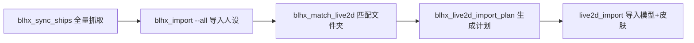

# 131 · Live2D 文件夹匹配与批量导入

**日期**：2026-07-07

## 需求

`D:\0HAN\HANDAILY\live2d` 有约 1556 个 Spine 模型包，文件夹名为拼音 slug（如 `adaerbote`、`adaerbote_2`），非中文。需：

1. 先将 BWIKI 舰娘人设批量导入小寒日报
2. 扫描 live2d 目录，按文件夹名匹配对应舰娘
3. 导入模型并绑定为人物皮肤

## 实现

### MCP 工具（`mcp/blhx-wiki`）

| 工具 | 说明 |
|------|------|
| `blhx_scan_live2d` | 扫描含 `.skel/.atlas/.png` 的文件夹 |
| `blhx_match_live2d` | slug 匹配 BWIKI 图鉴，结果写入 `live2d_mappings` 表 |
| `blhx_live2d_import_plan` | 结合 HANDAILY 人设/模型状态生成导入计划 |

匹配逻辑（`src/live2d.ts`）：

- 剥离皮肤后缀：`_2`、`_h`、`_g`、`_painting`、`_idol`、`_younv`、`_super` 等
- 剥离舰种后缀：`aijiangbb` → `aijiang`（无下划线形式）
- 拼音 slug 精确/前缀/包含/模糊匹配；META 舰娘降权
- 非标准罗马音：`data/live2d-aliases.json` 手动映射（如 `aijiang` → 埃吉尔）

示例：`adaerbote` / `adaerbote_2` → **阿达尔伯特亲王**（默认 / 皮肤2）

### CLI

**人设批量导入**（扩展 `blhx_import`）：

```powershell
cd src-tauri
cargo run --bin blhx_import -- --all --skip-existing --limit 50
```

**Live2D 模型导入**（新 `live2d_import`）：

```powershell
cd mcp/blhx-wiki
npm run live2d-plan -- --out plan.json
cd ../../src-tauri
cargo run --bin live2d_import -- --plan ../mcp/blhx-wiki/plan.json
```

`--dry-run` 仅预览；`--limit N` 限制条数。

### Rust 改动

- `character::attach_model_to_character(id, model, skin_name, set_active)` — 绑定到指定人物（非仅当前激活）
- `live2d_import` 读取计划 JSON，调用 `pet::models::import_from_folder` + 上述绑定

## 匹配率

约 **1450+/1556** 自动匹配（score ≥ 70）。未匹配多为：

- 联动/特殊命名（`hdn101`、`gin` 等）
- 极短 slug（`he`）
- 需在 `live2d-aliases.json` 补充的别名

## 完整流程



## 环境变量

| 变量 | 说明 |
|------|------|
| `HANDAILY_LIVE2D_PATH` | live2d 根目录，默认仓库 `live2d/` |
| `HANDAILY_DATA_DIR` | 小寒日报 data，默认 `%AppData%/xiaohan-daily/data` |
| `BLHX_WIKI_DB_PATH` | BWIKI SQLite |

## 相关

- [128-碧蓝航线BWIKI舰娘MCP](128-碧蓝航线BWIKI舰娘MCP-20260707.md)
- [129-本地BWIKI舰娘导入小寒日报](129-本地BWIKI舰娘导入小寒日报-20260707.md)
- [125-人物性格皮肤模型架构重构](125-人物性格皮肤模型架构重构-20260707.md)
