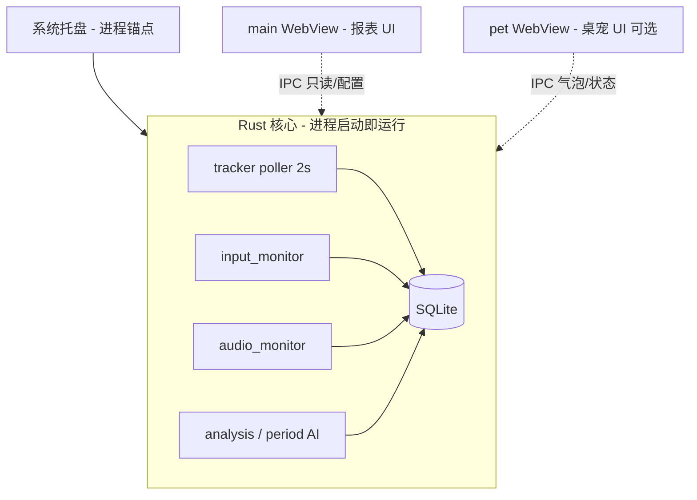

# 51 · 双壳架构与后台采集

**日期**：2026-07-03  
**类型**：架构说明

## 问题

桌宠和主页面是两个外壳，核心还是一个（收集数据的后端）；主页只是 UI 展示。理论上没有主页、只要后台进程还在，就应该继续记录。

## 答复

当前实现 **已是该模型**：

| 场景 | main | pet | 采集 |
|------|------|-----|------|
| 日常（release 默认） | 隐藏 | 可选显示 | ✅ 继续 |
| 关主窗口 X | 隐藏 | 任意 | ✅ 继续 |
| 关/藏桌宠 | 任意 | 隐藏或销毁 | ✅ 继续 |
| 托盘「暂停采集」 | — | — | ⏸ 暂停 |
| 托盘「退出」 | 销毁 | 销毁 | ⛔ stop_flag + flush |

### 代码要点

- `lib.rs` `setup()`：先 `AppState` + 四条 tracker/analysis 线程，再托盘/桌宠/主窗口
- `on_window_event(main)`：`CloseRequested` → `prevent_close` + `hide()`，不退出进程
- `tauri.conf.json`：release 下 main 默认 `visible: false`
- 采集开关仅 `tracking_enabled` / 托盘「暂停采集」，与窗口可见性无关

### 说明

- **开发模式**（`tauri dev`）为方便调试会自动 show main，不影响 release 行为
- main WebView 在 release 仍会在启动时创建（隐藏），占一定内存；后续可做「首次打开再建 main」优化

📁 已归档：`docs/questions/51-双壳架构与后台采集-20260703.md`
